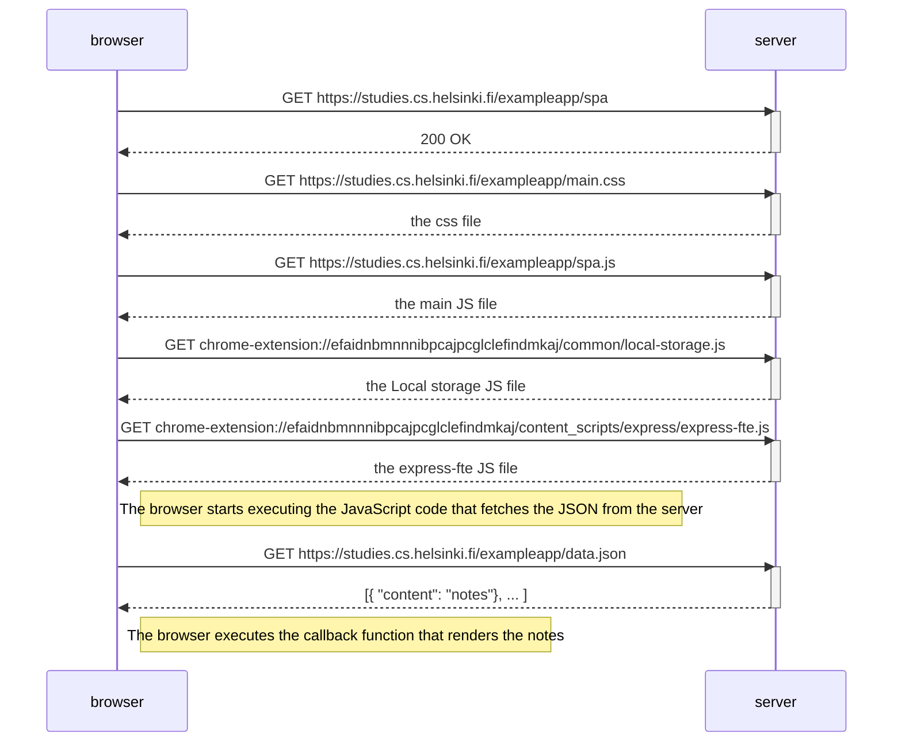

```mermaid
sequenceDiagram
    participant browser
    participant server

    browser->>server: GET https://studies.cs.helsinki.fi/exampleapp/spa
    activate server
    server-->>browser: 200 OK
    deactivate server

    browser->>server: GET https://studies.cs.helsinki.fi/exampleapp/main.css
    activate server
    server-->>browser: the css file
    deactivate server

    browser->>server: GET https://studies.cs.helsinki.fi/exampleapp/spa.js
    activate server
    server-->>browser: the main JS file
    deactivate server

    browser->>server: GET chrome-extension://efaidnbmnnnibpcajpcglclefindmkaj/common/local-storage.js
    activate server
    server-->>browser: the Local storage JS file
    deactivate server

    browser->>server: GET chrome-extension://efaidnbmnnnibpcajpcglclefindmkaj/content_scripts/express/express-fte.js
    activate server
    server-->>browser: the express-fte JS file
    deactivate server

    Note right of browser: The browser starts executing the JavaScript code that fetches the JSON from the server

    browser->>server: GET https://studies.cs.helsinki.fi/exampleapp/data.json
    activate server
    server-->>browser: [{ "content": "notes"}, ... ]
    deactivate server

    Note right of browser: The browser executes the callback function that renders the notes
```
